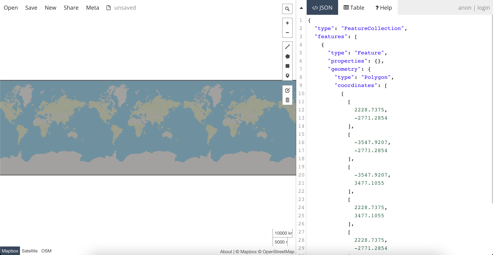
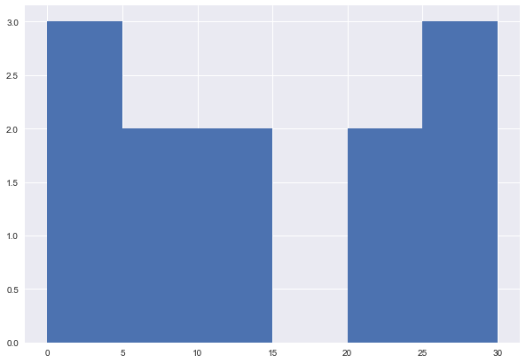
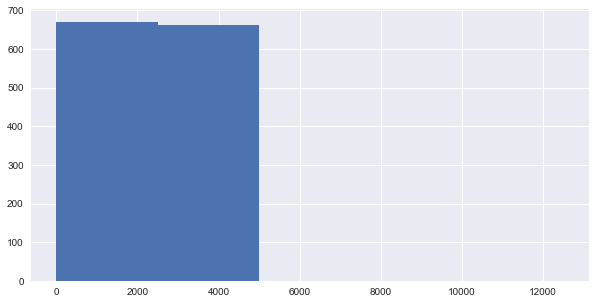
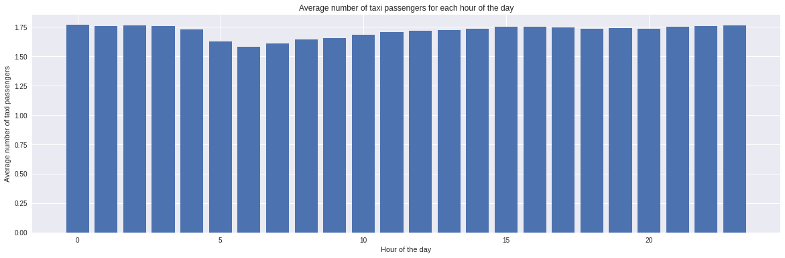
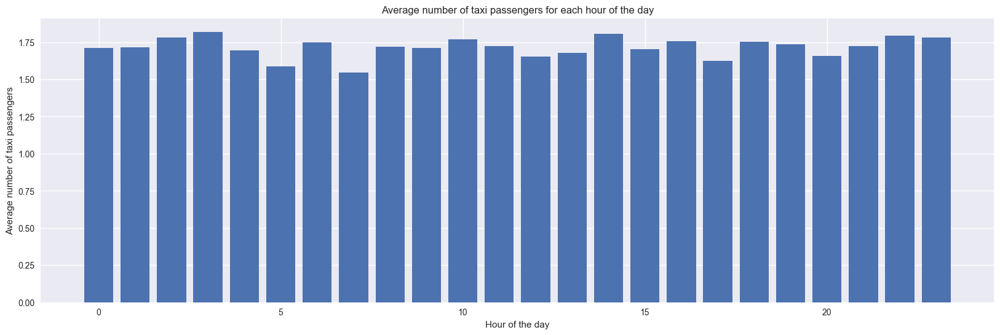

<h1 align='center'> In this project i have analyzed a dataset which contains information about taxi rides in NYC.  The data set is quite large so getting a basic idea of what the data contains is important. </h1>

## Datetime range does your data cover?  How many rows are there total

``` 
import datetime, csv
file=open("/Users/ksr/Downloads/trip_data_1.csv",'r')
reader=csv.reader(file)
minval=None
maxval=None
n=0
for row in reader:
    if n>0:
        dto=None
        dts=row[5]
        try:
            dto=datetime.datetime.strptime(dts,"%Y-%m-%d %H:%M:%S")
        except Exception as e:
            print(e)
            if dto is not None:
                if maxval is None or dto>maxval:
                    maxval=dto
                elif minval is None or dto<minval:
                    minval=dto
    n+=1
print(minval,maxval)

```
Output: 87 2228.7375 -2771.2854


## Field names

```
import csv
file=open("/Users/ksr/Downloads/trip_data_1.csv",'r')
reader=csv.reader(file)


for row in reader:
    print(row)
    break
```    

Output: ['medallion', 'hack_license', 'vendor_id', 'rate_code', 'store_and_fwd_flag', 'pickup_datetime', 'dropoff_datetime', 'passenger_count', 'trip_time_in_secs', 'trip_distance', 'pickup_longitude', 'pickup_latitude', 'dropoff_longitude', 'dropoff_latitude']


## Sample Data

```
import csv
file=open("/Users/ksr/Downloads/trip_data_1.csv",'r')
reader=csv.reader(file)

n=0
for row in reader:
    print(row)
    n+=1
    if n>5:
        break
        
```

Output:

['medallion', 'hack_license', 'vendor_id', 'rate_code', 'store_and_fwd_flag', 'pickup_datetime', 'dropoff_datetime', 'passenger_count', 'trip_time_in_secs', 'trip_distance', 'pickup_longitude', 'pickup_latitude', 'dropoff_longitude', 'dropoff_latitude']
['89D227B655E5C82AECF13C3F540D4CF4', 'BA96DE419E711691B9445D6A6307C170', 'CMT', '1', 'N', '2013-01-01 15:11:48', '2013-01-01 15:18:10', '4', '382', '1.00', '-73.978165', '40.757977', '-73.989838', '40.751171']
['0BD7C8F5BA12B88E0B67BED28BEA73D8', '9FD8F69F0804BDB5549F40E9DA1BE472', 'CMT', '1', 'N', '2013-01-06 00:18:35', '2013-01-06 00:22:54', '1', '259', '1.50', '-74.006683', '40.731781', '-73.994499', '40.75066']
['0BD7C8F5BA12B88E0B67BED28BEA73D8', '9FD8F69F0804BDB5549F40E9DA1BE472', 'CMT', '1', 'N', '2013-01-05 18:49:41', '2013-01-05 18:54:23', '1', '282', '1.10', '-74.004707', '40.73777', '-74.009834', '40.726002']
['DFD2202EE08F7A8DC9A57B02ACB81FE2', '51EE87E3205C985EF8431D850C786310', 'CMT', '1', 'N', '2013-01-07 23:54:15', '2013-01-07 23:58:20', '2', '244', '.70', '-73.974602', '40.759945', '-73.984734', '40.759388']
['DFD2202EE08F7A8DC9A57B02ACB81FE2', '51EE87E3205C985EF8431D850C786310', 'CMT', '1', 'N', '2013-01-07 23:25:03', '2013-01-07 23:34:24', '1', '560', '2.10', '-73.97625', '40.748528', '-74.002586', '40.747868']


## MYSQL data types and Length

```
import csv
f = open("/Users/ksr/Downloads/trip_data_1.csv", 'r')
reader = csv.reader(f)
n=0
for row in reader:
  for i in range(14):
    if i!=13:
      print(row[i], end='|')
    else:
      print(row[i])
  
  if n ==0:
    print('---------------------------|'*14)
  n+=1
  if n==5:
    break

```
Output:

medallion|hack_license|vendor_id|rate_code|store_and_fwd_flag|pickup_datetime|dropoff_datetime|passenger_count|trip_time_in_secs|trip_distance|pickup_longitude|pickup_latitude|dropoff_longitude|dropoff_latitude

89D227B655E5C82AECF13C3F540D4CF4|BA96DE419E711691B9445D6A6307C170|CMT|1|N|2013-01-01 15:11:48|2013-01-01 15:18:10|4|382|1.00|-73.978165|40.757977|-73.989838|40.751171
0BD7C8F5BA12B88E0B67BED28BEA73D8|9FD8F69F0804BDB5549F40E9DA1BE472|CMT|1|N|2013-01-06 00:18:35|2013-01-06 00:22:54|1|259|1.50|-74.006683|40.731781|-73.994499|40.75066
0BD7C8F5BA12B88E0B67BED28BEA73D8|9FD8F69F0804BDB5549F40E9DA1BE472|CMT|1|N|2013-01-05 18:49:41|2013-01-05 18:54:23|1|282|1.10|-74.004707|40.73777|-74.009834|40.726002
DFD2202EE08F7A8DC9A57B02ACB81FE2|51EE87E3205C985EF8431D850C786310|CMT|1|N|2013-01-07 23:54:15|2013-01-07 23:58:20|2|244|.70|-73.974602|40.759945|-73.984734|40.759388


## Geographic Range

```
import csv, folium
f = open("/Users/ksr/Downloads/trip_data_1.csv", 'r')
reader = csv.reader(f)
maxlong = 0
minilong = 0
maxlat = 0 
minilat = 0
ex =0
for row in reader:
  try:
    if float(row[10]) >= float(row[12]) and float(row[10]) >= maxlong:
      maxlong = float(row[10])
    elif float(row[10]) <= float(row[12]) and float(row[10]) <= minilong:
      minilong = float(row[10])
    elif float(row[12]) >= float(row[10]) and float(row[12]) >= maxlong:
      maxlong = float(row[12])
    elif float(row[12]) <= float(row[10]) and float(row[12]) <= minilong:
      minilong = float(row[12])
    
    if float(row[11]) >= float(row[13]) and float(row[11]) >= maxlat:
      maxlat = float(row[11])
    elif float(row[11]) <= float(row[13]) and float(row[11]) <= minilat:
      minilat = float(row[11])
    elif float(row[13]) >= float(row[11]) and float(row[13]) >= maxlat:
      maxlat = float(row[13])
    elif float(row[13]) <= float(row[11]) and float(row[13]) <= minilat:
      minilat = float(row[13])
  except Exception as e:
    ex+=1


print(ex, maxlong,minilong, maxlat,minilat)

```

Output:
87 2228.7375 -2771.2854 3477.1055 -3547.9207





## Average computed Trip distance 

```
import csv
from math import radians, cos, sin, asin, sqrt
f = open("/Users/ksr/Downloads/trip_data_1.csv", 'r')
reader = csv.reader(f)

def haversine(lon1, lat1, lon2, lat2):
    """
    Calculate the great circle distance in kilometers between two points 
    on the earth (specified in decimal degrees)
    """
    # convert decimal degrees to radians 
    lon1, lat1, lon2, lat2 = map(radians, [lon1, lat1, lon2, lat2])

    # haversine formula 
    dlon = lon2 - lon1 
    dlat = lat2 - lat1 
    a = sin(dlat/2)**2 + cos(lat1) * cos(lat2) * sin(dlon/2)**2
    c = 2 * asin(sqrt(a)) 
    r = 6371 # Radius of earth in kilometers. Use 3956 for miles. Determines return value units.
    return c * r


n=0
z = 0.0
ex =0
x = []
for row in reader:
  n+=1
  try:
    lon1,lat1,lon2,lat2 = float(row[10]),float(row[11]),float(row[12]),float(row[13])
    z += haversine(lon1,lat1,lon2,lat2)
    x.append(z)
  except Exception as e:
    ex +=1

print("Average Haversine Distance =", z/(n-ex) )

```

Output:    
       
Average Haversine Distance = 19.597999536473484


## Data comparision by plotting Histogram

```

print(x[:5])

from matplotlib import pyplot as plt
plt.style.use('seaborn')
import numpy as np
 

fig, ax = plt.subplots(figsize =(10, 7))
ax.hist(x, bins = [0,5,10,15,20,25,30])
 

plt.show()

fig, ax = plt.subplots(figsize =(10, 5))
ax.hist(x, bins = [0,2500, 5000,7500,10000,12500])
 

plt.show()
Output of plots: [1.240760594407495, 3.577535155709607, 4.955543943134076, 5.8111576389775506, 8.03090697280956]

  plt.style.use('seaborn')

```

Output:





## Distint values for each field 
```
from math import radians, cos, sin, asin, sqrt
import csv

n=0
med = dict()
hack_l = dict()
vid = dict()
rc= dict()
snff= dict()
pc = dict()
tt = dict()
f = open("/Users/ksr/Downloads/trip_data_1.csv", 'r')
reader = csv.reader(f)
for row in reader:
  if row[0] in med:
    med[row[0]]+=1
  else:
    med[row[0]]=1

  if row[1] in hack_l:
    hack_l[row[1]]+=1
  else:
    hack_l[row[1]]=1

  if row[2] in vid:
    vid[row[2]]+=1
  else:
    vid[row[2]]=1

  if row[3] in rc:
    rc[row[3]]+=1
  else:
    rc[row[3]]=1

  if row[4] in snff:
    snff[row[4]]+=1
  else:
    snff[row[4]]=1

  if row[7] in pc:
    pc[row[7]]+=1
  else:
    pc[row[7]]=1
  
  if row[8] in tt:
    tt[row[8]] +=1
  else:
    tt[row[8]] =1
  n+=1

print(len(med), len(hack_l), len(vid), len(rc), len(snff), len(pc),len(tt))
13427 32225 3 15 4 11 6595
In [3]:
import csv
f = open("/Users/ksr/Downloads/trip_data_1.csv", 'r')
reader = csv.reader(f)

td_9 = dict()
plong_10 = dict()
plat_11 = dict()
dlong_12 = dict()
dlat_13 = dict()
for row in reader:
  if row[9] in td_9:
    td_9[row[9]]+=1
  else:
    td_9[row[9]]=1 

  if row[10] in plong_10:
    plong_10[row[10]]+=1
  else:
    plong_10[row[10]]=1 

  if row[11] in plat_11:
    plat_11[row[11]]+=1
  else:
    plat_11[row[11]]=1

  if row[12] in dlong_12:
    dlong_12[row[12]]+=1
  else:
    dlong_12[row[12]]=1

  if row[13] in dlat_13:
    dlat_13[row[13]]+=1
  else:
    dlat_13[row[13]]=1

print(len(td_9),len(plong_10),len(plat_11),len(dlong_12),len(dlat_13))
print(rc)

```
Output:

4369 40443 64512 56251 88768
{'rate_code': 1, '1': 14456067, '2': 239160, '4': 22831, '5': 39889, '3': 17655, '6': 315, '8': 10, '0': 667, '210': 11, '28': 2, '7': 2, '9': 1, '65': 1, '128': 4}


## Numeric Types


``` 
import csv
f = open("/Users/ksr/Downloads/trip_data_1.csv", 'r')
reader = csv.reader(f)

min_rc = 0
max_rc = 0
min_pc= 0
max_pc = 0
min_tis = 0
max_tis= 0
min_td = 0
max_td = 0
n=0
for row in reader:
  #print(row[3])
  n+=1
  try:
    if int(row[3]) <= min_rc or min_rc ==0:
      min_rc = int(row[3])
    if int(row[3]) >= max_rc or max_rc ==0:
      max_rc = int(row[3])
  except Exception as e:
    print(e)
  try:
    if int(row[7]) <= min_pc or min_pc ==0:
      min_pc = int(row[7])
    if int(row[7]) >= max_pc or max_pc ==0:
      max_pc = int(row[7])
  except Exception as e:
    print(e)
  try:
    if int(row[8]) <= min_tis or min_tis ==0:
      min_tis = int(row[8])
    if int(row[8]) >= max_tis or max_tis ==0:
      max_tis = int(row[8])
  except Exception as e:
    print(e)
  try:
    if float(row[9]) <= min_td or min_td ==0:
      min_td = float(row[9])
    if float(row[9]) >= max_tis or max_td ==0:
      max_td = float(row[9])
  except Exception as e:
    print(e)


print(n) 

```

invalid literal for int() with base 10: 'rate_code'
invalid literal for int() with base 10: 'passenger_count'
invalid literal for int() with base 10: 'trip_time_in_secs'
could not convert string to float: 'trip_distance'
14776616
In [2]:
print(max_rc, min_rc)
print(max_pc, min_pc)
print(max_tis, min_tis)
print(max_td, min_td)
210 1
255 1
10800 48
1.0 0.5

## Chart which shows passengers each hour of a day
```

import datetime,csv
#import csv
f = open("/Users/ksr/Downloads/trip_data_1.csv", 'r')
reader = csv.reader(f)
exp =0
n=0
pcl =  [0,0,0,0,0,0,0,0,0,0,0,0,0,0,0,0,0,0,0,0,0,0,0,0]
hc =  [0,0,0,0,0,0,0,0,0,0,0,0,0,0,0,0,0,0,0,0,0,0,0,0]

#f = open(fn, 'r')
#reader = csv.reader(f)
for row in reader:
  n+=1
  try:
    dts = row[5]
    dto = datetime.datetime.strptime(dts,"%Y-%m-%d %H:%M:%S")
  except Exception as e:
    exp+=1
    print(e)
  h = dto.hour  
  try:
    ipc = int(row[7])    
    hc[h]+=1
    pcl[h]+=ipc
  except Exception as e:
    print(e)

        #except Exception as e:
         # exp+=1
          #print(e)

          averages = []

for i in range(len(hc)):
  averages.append(pcl[i] / hc[i])

  from matplotlib import pyplot as plt
plt.style.use('seaborn')
import numpy as np
 
# Creating histogram
plt.figure(figsize=(20,6))
plt.xlabel('Hour of the day')
plt.ylabel('Average number of taxi passengers')
plt.title('Average number of taxi passengers for each hour of the day')
plt.bar(x=range(0,24), height=averages)
plt.show()

```
Output:




##  A new CSV file which has only one out of every thousand rows.


```

import csv
fn = 'trip_data_6.csv'
f = open(fn, 'r')
reader = csv.reader(f)
fnew = open('new.csv', 'w')
fnew.write('')
fnew.close()
fnew = open('new.csv', 'w')
writer = csv.writer(fnew,delimiter=',',lineterminator='\n')

n = 0
nn=0
for row in reader:
    if n % 1000 == 0:
        nn+=1
        writer.writerow(row)
    n+=1
print(n,nn)
fnew.close

```
Output: 

14385457 14386


## Comparison of data in the previous charts and drawing a final chart on number of passanger on a each day

```

import datetime,csv

fn = "/Users/ksr/Downloads/trip_data_1.csv"
f = open(fn,'r')
reader = csv.reader(f)
exp =0
n=0
pcl =  [0,0,0,0,0,0,0,0,0,0,0,0,0,0,0,0,0,0,0,0,0,0,0,0]
hc =  [0,0,0,0,0,0,0,0,0,0,0,0,0,0,0,0,0,0,0,0,0,0,0,0]

#f = open(fn, 'r')
#reader = csv.reader(f)
for row in reader:
  n+=1
  try:
    dts = row[5]
    dto = datetime.datetime.strptime(dts,"%Y-%m-%d %H:%M:%S")
  except Exception as e:
    exp+=1
    print(e)
  h = dto.hour  
  try:
    ipc = int(row[7])    
    hc[h]+=1
    pcl[h]+=ipc
  except Exception as e:
    print(e)

averages = []

for i in range(len(hc)):
  averages.append(pcl[i] / hc[i])

from matplotlib import pyplot as plt
plt.style.use('seaborn')
import numpy as np
 
# Creating histogram
plt.figure(figsize=(20,6))
plt.xlabel('Hour of the day')
plt.ylabel('Average number of taxi passengers')
plt.title('Average number of taxi passengers for each hour of the day')
plt.bar(x=range(0,24), height=averages)
plt.show()

```




